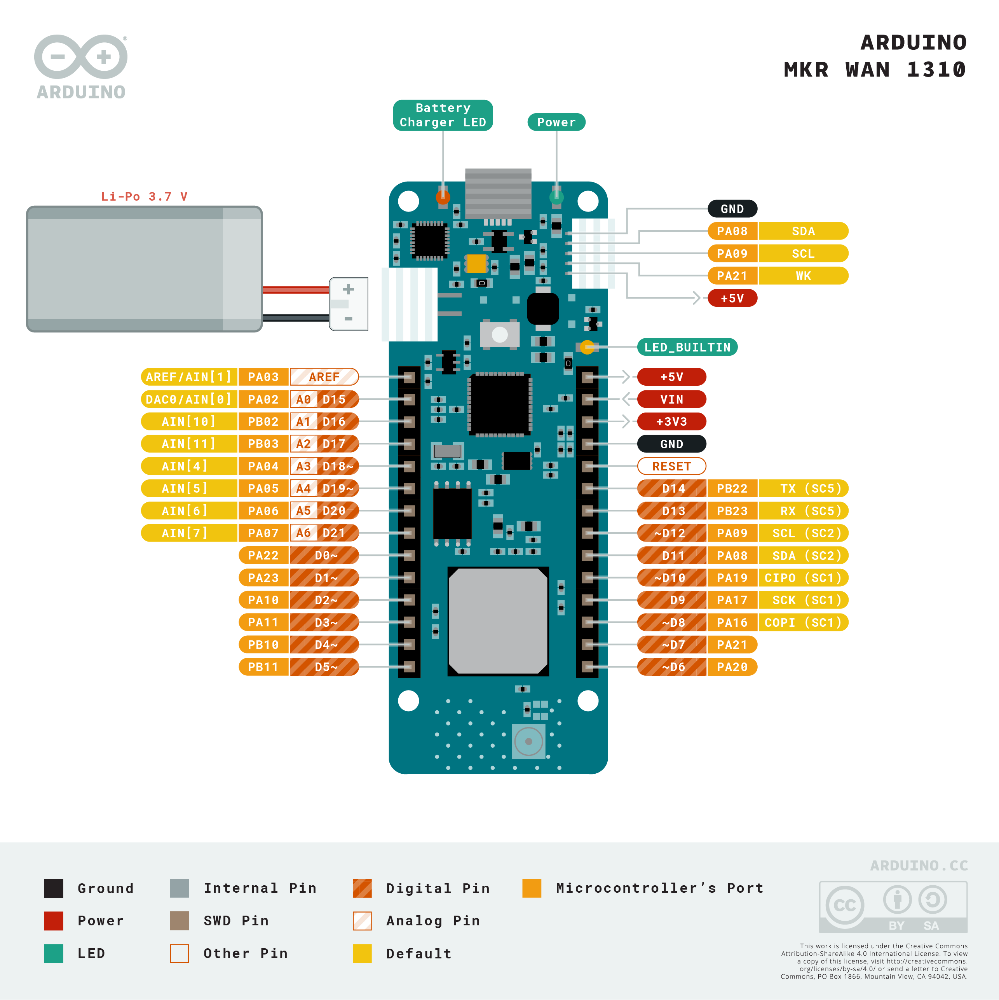

<h1>LoRaWAN enabled M-Bus-reader firmware for the Arduino MKRWAN 1310</h1>

Attempts to OTAA-join the connected TTS instance on power-on. Scans M-Bus addresses for devices and sends full M-Bus telegrams binary-encoded at chosen interval.  
Further development will enable an application to choose the content of the uplink packages. Package interval should also be automatically updated based on spreading factor. 

<h2>MKRWAN 1310 pinout</h2>

<h2>Todo</h2>
<ol>
    <li>ADR handling<ul>
        <li><s>Tune sending interval depending on package length and spreading factor</s><ul>
            <li><s>Package time calculator</s></li>
        </ul></li>
        <li><s>Set minimum interval</s></li>
        <li><s>Set specific interval</s></li>
        <li>Test ADR functionality</li>
    </ul></li>
    <li><s>Heartbeat function</s></li>
    <li>Time keeping, time based events</li>
    <li>Local M-Bus parsing<ul>
        <li>Parse to cayenne</li>
    </ul></li>
    <li>Downlink handling<ul>
        <li><s>Downlink switch statement</s></li>
        <li>Get devices</li>
        <li>Enable/Disable devices</li>
        <li><s>Set uplink interval</s></li>
        <li>Custom uplinks selection<ul> 
            <li><s>Choose specific datatypes/sensors to send as uplink</s></li>
            <li>Request custom uplink list</li>
            <li>Per device specific packages</li>
            <li>Option for event based packages<ul>
                <li>Delta before event?</li>
                <li>Specific members are event-based</li>
                </ul></li>
            </ul></li>
        <li><s>Power cycle command</s><ul>
            </ul></li>
        <li><s>Random join wait - Use deviceEUI as seed</s></li>
        <li><s>Increasing rejoin interval</s></li>
        <li>Rescan M-Bus addresses command</li>
        <li>Modify M-Bus scan command to only add new devices, perhaps throw the old list?</li>
        <li><s>Forced rejoin</s></li>
    </ul></li>
</ol>